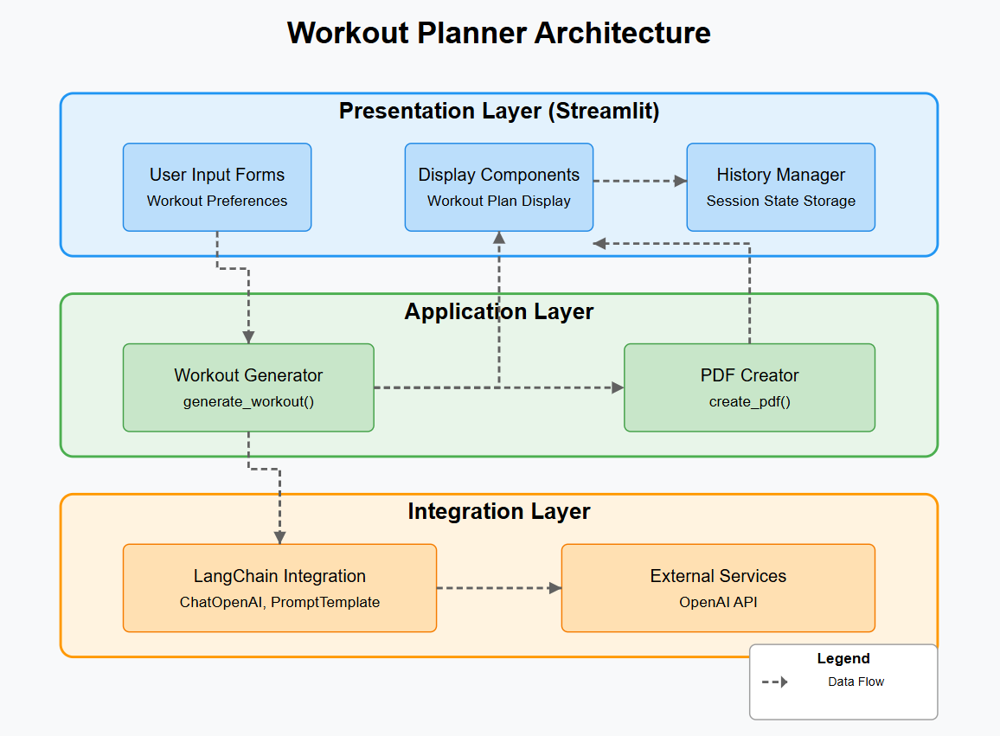

# AI Powered Fitness Coach with Personalized Workouts
Generative AI-based fitness web app that delivers personalized workout plans and AI coaching—at zero cost. It leverages the power of OpenAI, LangChain, and Streamlit to build an interactive, intelligent platform tailored to each user’s needs.

## Problem Statement

Many people struggle to stay fit because they don’t have a personal trainer or a workout plan that fits their needs. Hiring a coach is expensive, and most online workout plans are too general.

This project, AI-Powered Fitness Coach, solves this problem by using AI (OpenAI), Python, Streamlit, and LangChain to:
- Create personalized workout plans based on user details (age, weight, fitness level, goals).
- Provide AI-powered coaching with real-time advice and fitness tips.
- Let users chat with an AI fitness coach to ask workout-related questions.
- Offer a simple, interactive web app (built with Streamlit) for easy access.

With this project, anyone can get a custom fitness plan and coaching for free using AI! 




### Installation Steps

**1.  Clone the project**
```bash
git clone https://github.com/
cd ai-fitness-coach
```

**2. Create a virtual environment**
```bash
conda create -p env python=3.10 -y
```

**3. Install dependencies**
```bash
pip install -r requirements.txt
```

**4. Run application**
```bash
streamlit run app.py
```
## Key Features 
***Personalized Workout Plans***
- Get workout routines made just for you based on your age, weight, fitness level, and goals.

***Smart AI with LangChain***
- Uses smart logic to understand your needs and give better, more accurate plans.

***Easy-to-Use Web App***
- Built with Streamlit, so it's simple and interactive for everyone to use.

***Download Your Plan***
- Easily save your workout routine as a PDF file.

***Plan History***
- Your previous workout plans are saved so you can go back and check them anytime.

## Sample Workout Plan Generated by AI


## Data Flow

1. User inputs workout preferences through the Streamlit UI
2. Application processes these inputs using the workout generator
3. Workout generator creates a prompt and sends it to LangChain
4. LangChain communicates with OpenAI API to generate a personalized workout plan
5. Generated plan is returned and displayed to the user
6. Optional PDF creation for downloading the workout plan
6. Plan is stored in session history for future reference

